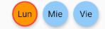

# weekday_selector_formfield

This widget allows the user to choose one or many weekdays. The selector is customizable and it has all the posibilities expected on a Form Field.
Languages Availables: English, Spanish, Portuguese

## Getting Started

To use this package, you only need to install/import it to the project and then call it in the Widget's Build method.

## Default View Example
```
WeekDaySelectorFormField()
```


## Custom Example
You can set the 'displayDay' attribute to choose the days you want to show. These days will appear in the same order of the array.
Alternatively, you can set displayDays equal to WeekDayPicker.weekendDays or WeekDayPicker.workDays to show theese days. by default, the widget will show ALL weekDays

Link to repository: 
https://github.com/andreskiu/weekday_selector_formfield/tree/master/weekday_selector_formfield

```
WeekDaySelectorFormField(
      displayDays: [days.monday, days.wednesday, days.friday],
      initialValue: [days.monday],
      borderRadius: 20,
      selectedFillColor: Colors.orange,
      borderSide: BorderSide(color: Colors.red, width: 2),
      language: lang.es,
      onChange: (days) {
        print("Selected Days: " + days.toString());
      },
    );

```


For help getting started with Flutter, view our 
[online documentation](https://flutter.dev/docs), which offers tutorials, 
samples, guidance on mobile development, and a full API reference.
